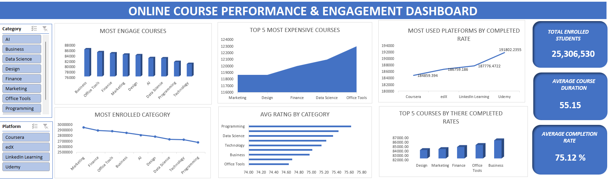

# Data analytic portfolio 

# Project 1

**Title:** [Online Courses Performance & Engagement Dashboard](https://github.com/justice3613/justice3613.github.io/blob/main/online_courses_uses.xlsx)

**Tools Used:** Microsoft Excel (Data cleaning, transformation, dashboard creation), Pivot Tables & Charts (Data summarization and visualization),
Data Visualization Techniques (KPIs, bar charts, line charts, slicers)

**Project Description:** 

This project involved analyzing online course data to identify trends and patterns in course performance, engagement, and pricing across different platforms. It is designed to provide a comprehensive overview of key performance metrics within the online learning space.  

The dashboard allows stakeholders to easily monitor and evaluate course performance across categories, platforms, and key indicators such as enrollment and completion rates.  

**Dashboard Features:**

- **Most Engaged Courses:** Visual representation of course categories with the highest user engagement levels  
- **Top 5 Most Expensive Courses:** Highlights the pricing distribution of the most expensive course categories  
- **Most Used Platforms by Completion Rate:** Shows platform performance based on course completion rates  
- **Most Enrolled Categories:** Displays categories with the highest number of enrolled students  
- **Average Rating by Category:** Breaks down user ratings across different course categories  
- **Top 5 Courses by Completion Rates:** Identifies courses with the highest completion rates
  
**Filters Available:**

- **Category:** Analyze performance across different course categories  
- **Platform:** Compare performance across learning platforms  

---

**Key findings:**

- **High Engagement Categories:** Business and Office Tools courses show the highest engagement levels  
- **Pricing Trends:** Office Tools and Data Science courses tend to be more expensive  
- **Platform Performance:** Udemy has the highest completion rates among the platforms analyzed  
- **Enrollment Insights:** Marketing and Finance categories attract the most students  
- **Top-Rated Categories:** Programming and Data Science receive the highest average ratings  
- **Engagement Gap:** There is a noticeable gap between enrollments and completion rates, suggesting drop-off in user retention  

---

This dashboard serves as a practical tool for analyzing online course performance and provides clear, actionable insights to support better decision-making.

**Dashboard Overview:**

**Recommendations for Improving Engagement & Performance**
- learn from high performing platforms, since udemy has higher completion rates, analyze what works (e.g., course structure, pricing, ux) and apply similar strategies across other platforms and also focus on ease of access and flexible learning formats.
- There’s a clear gap between enrollments and completion, therefore improve course completion rates by breaking content into shorter, more manageable lessons
- Introduce certificates or rewards to motivate completion and also try using interactive elements (quizzes, assignments, projects).
- optimize pricing strategy, some categories (like office tools & data science) are more expensive test tiered pricing (basic vs premium versions), offer discounts or bundles for high priced courses, align pricing with course length, value, and demand.
- leverage high rated categories like (programming and data science) that have the best ratings, promote these courses more aggressively, use them as benchmark standards for other categories, expand into related niche topics.
---
# Project 2

**Title:** SQL Data Definition Language Sales Data

**SQL Code:** [Sales Data](https://github.com/justice3613/justice3613.github.io/blob/main/Sales_data.sql)

**SQL Skills Used:** 
- Creating databases and tables using CREATE DATABASE and CREATE TABLE  
- Inserting records with INSERT INTO  
- Modifying table structure using ALTER TABLE (add, drop, and modify columns)  
- Updating records using UPDATE  
- Deleting records with DELETE  
- Removing and resetting tables using TRUNCATE and DROP  
- Querying data using SELECT  
- Filtering data with WHERE, IN, NOT IN, and comparison operators  
- Working with date functions like DATEDIFF()  
- Handling real-world datasets (e.g., workplace safety data)
- Data Source Specification (FROM): Workplace Safety Data table

**Project Description:** This project demonstrates hands-on experience in managing and manipulating data using SQL. I designed and developed a sample database (ExpressSales) to store sales manager records, including key attributes such as personal details and location.

The work involved inserting and updating data, modifying table structures to meet changing requirements, and performing data cleaning based on specific conditions. I also applied SQL queries to analyze a workplace safety dataset, filtering and extracting insights based on factors like location and incident type.

Overall, this project highlights practical SQL skills in database design, data transformation, and querying to support real-world data analysis tasks.

**Technology used:** SQL server

---

# Project 3

**Title:** Employee Management System SQL Queries

**SQL Code:** [Employee Management System](https://github.com/justice3613/justice3613.github.io/blob/main/Employee%20Management%20System.sql)

**SQL Skills Used:** 
- Writing SELECT queries to pull specific data
- Filtering results using WHERE, BETWEEN, AND, and OR 
- Using aggregate functions like COUNT(), MAX(), MIN(), and AVG()
- Removing duplicates with DISTINCT
- Pattern matching with LIKE and wildcards (%, _)
- Combining results from multiple tables using UNION
- Creating calculated columns (e.g., total salary)
- Calculated fields and expressions for derived data.
- Data Source Specification (FROM): Employee_Details and Employee_Salary table

**Project Description:** This project is a set of structured SQL queries that work with an employee database. The goal was to answer real business questions, like finding employees who work for certain managers, looking at salary distributions, filtering employees by location and project assignments, and searching for patterns in employee names.

There are tables in the dataset like EmployeeDetails and EmployeeSalary that let you look into how employee information, project assignments, and pay are all connected. Each query shows a basic SQL idea while also showing how it would be used in real life, like in data analysis and backend systems.

**Technology used:** SQL server

---
# Project 4

**Title:**  SQL MultiTable Queries and Reports

**SQL Code:** [SQL MultiTable Queries and Reports](https://github.com/justice3613/justice3613.github.io/blob/main/SQL_MultiTable_Queries_and_Reports.sql)

**SQL Skills Used:** 
- Writing multi table queries using JOIN (INNER, LEFT, RIGHT, CROSS)
- Working with relationships between tables (salesman, customer, orders)
- Filtering data using WHERE, BETWEEN, and conditional logic
- Sorting results using ORDER BY
- Generating reports with multiple fields from different tables
- Using aggregate-style thinking for business reporting scenarios
- Handling Cartesian products (CROSS JOIN)
- Applying business rules (e.g., commission thresholds, grade filters)
- Combining and structuring data for real-world use cases
- Writing optimized queries for relational datasets

**Project Description:**  This project is about writing complex SQL queries for a sales database that has tables for salespeople, customers, and orders.

The queries are made to help with real business problems, like figuring out how salespeople and customers are related, looking at order patterns, and making structured reports. The project includes a lot of different situations, such as filtering data by order amounts, figuring out commission percentages, and comparing where customers and salespeople are located.

It also looks at more advanced ideas like multi-table joins, conditional reporting, and Cartesian products to model complicated data relationships. There are a number of queries that can be used to make business-style reports, like keeping track of customer orders, finding customers who aren't buying anything, and looking at how well sales are doing.

**Technology used:**  SQL server
