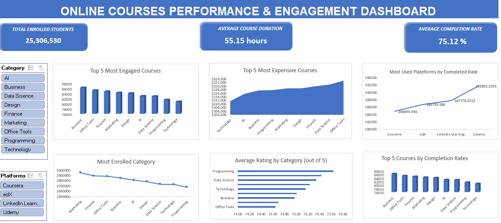
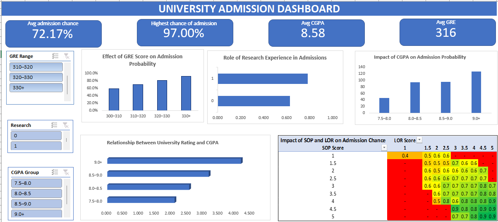

# Data analytic portfolio 

# 📚 [Online Courses Performance & Engagement Dashboard](https://github.com/justice3613/Justice3613.github.io/blob/main/online_courses_uses.xl)

## 📌 Overview
This project analyzes online course data to understand patterns in student engagement, completion rates, and platform performance. The goal is to identify what drives course success across different categories and learning platforms.

The dashboard provides an interactive view of how factors like category, platform, pricing, and ratings influence enrollment and completion behavior.

---

**Filters Available:**

- **Category:** Analyze performance across different course categories  
- **Platform:** Compare performance across learning plat

---

## 🛠 Tools Used
- Microsoft Excel (Pivot Tables, Power Query)
- Data Cleaning & Transformation
- Data Visualization

---

## 📊 Features
- Interactive filters for course category and platform
- Comparison of engagement levels across course types
- Analysis of completion rates by platform
- Identification of top-performing courses and categories
- KPI cards for quick performance overview

---

## 📈 Key Insights
- Business and Office Tools courses show the highest engagement levels
- Programming and Data Science courses have the highest average ratings
- Udemy demonstrates the strongest completion rates among platforms
- Marketing courses attract the highest enrollments but do not always lead to the highest completion rates, indicating potential engagement or content quality gaps
- Higher-priced courses tend to cluster in technical and professional categories

---

## 📷 Dashboard Preview

  
---

# Project 2
# 🎓[University Admission Dashboard](https://github.com/justice3613/Justice3613.github.io/blob/main/admission_data_set.xlsx)

## 🛠 Tools Used
- Microsoft Excel (Pivot Tables, Power Query)
- Data Cleaning & Transformation
- Data Visualization
  
---

## 📌 Project Description:
This project explores how GRE scores, CGPA, research experience, and supporting documents (SOP & LOR) influence admission chances all through an interactive Excel dashboard designed for quick, real insights.

This project analyzes the key factors influencing university admission probability using an interactive Excel dashboard. It focuses on understanding how academic performance and supporting elements combine to impact outcomes.

---

## 📊 Features
- Interactive filters (GRE score, CGPA group, research experience)
- Visual breakdown of admission probability
- Comparative analysis across different student profiles
- Clean and intuitive dashboard layout

---

## 📈 Key findings
- Higher **GRE scores** increase admission probability, especially above 320+
- **CGPA** is the strongest driver of admission success
- **Research experience** adds value but is secondary to academics
- Strong **SOP & LOR** can significantly boost chances in competitive profiles
- Top universities require a balanced, all round strong application

---

## 🧠 What This Project Shows
Admissions are not based on a single factor. Strong academics form the foundation, while supporting elements like SOP and LOR help differentiate candidates with similar scores.

---

## 📷 Dashboard Preview
 

---

# Project 3

**Title:** SQL Data Definition Language Sales Data

**SQL Code:** [Sales Data](https://github.com/justice3613/Justice3613.github.io/blob/main/Sales%20Data)

**SQL Skills Used:** 
- Creating databases and tables using CREATE DATABASE and CREATE TABLE  
- Inserting records with INSERT INTO  
- Modifying table structure using ALTER TABLE (add, drop, and modify columns)  
- Updating records using UPDATE  
- Deleting records with DELETE  
- Removing and resetting tables using TRUNCATE and DROP  
- Querying data using SELECT  
- Filtering data with WHERE, IN, NOT IN, and comparison operators  
- Working with date functions like DATEDIFF()  
- Handling real-world datasets (e.g., workplace safety data)
- Data Source Specification (FROM): Workplace Safety Data table

**Project Description:** This project demonstrates hands-on experience in managing and manipulating data using SQL. I designed and developed a sample database (ExpressSales) to store sales manager records, including key attributes such as personal details and location.

The work involved inserting and updating data, modifying table structures to meet changing requirements, and performing data cleaning based on specific conditions. I also applied SQL queries to analyze a workplace safety dataset, filtering and extracting insights based on factors like location and incident type.

Overall, this project highlights practical SQL skills in database design, data transformation, and querying to support real-world data analysis tasks.

**Technology used:** SQL server

---

# Project 4

**Title:** Employee Management System SQL Queries

**SQL Code:** [Employee Management System](https://github.com/justice3613/Justice3613.github.io/blob/main/Employee%20Management%20System)

**SQL Skills Used:** 
- Writing SELECT queries to pull specific data
- Filtering results using WHERE, BETWEEN, AND, and OR 
- Using aggregate functions like COUNT(), MAX(), MIN(), and AVG()
- Removing duplicates with DISTINCT
- Pattern matching with LIKE and wildcards (%, _)
- Combining results from multiple tables using UNION
- Creating calculated columns (e.g., total salary)
- Calculated fields and expressions for derived data.
- Data Source Specification (FROM): Employee_Details and Employee_Salary table

**Project Description:** This project is a set of structured SQL queries that work with an employee database. The goal was to answer real business questions, like finding employees who work for certain managers, looking at salary distributions, filtering employees by location and project assignments, and searching for patterns in employee names.

There are tables in the dataset like EmployeeDetails and EmployeeSalary that let you look into how employee information, project assignments, and pay are all connected. Each query shows a basic SQL idea while also showing how it would be used in real life, like in data analysis and backend systems.

**Technology used:** SQL server

---
# Project 5

**Title:**  SQL MultiTable Queries and Reports

**SQL Code:** [SQL MultiTable Queries and Reports](https://github.com/justice3613/Justice3613.github.io/blob/main/SQL%20MultiTable%20Queries%20and%20Reports)

**SQL Skills Used:** 
- Writing multi table queries using JOIN (INNER, LEFT, RIGHT, CROSS)
- Working with relationships between tables (salesman, customer, orders)
- Filtering data using WHERE, BETWEEN, and conditional logic
- Sorting results using ORDER BY
- Generating reports with multiple fields from different tables
- Using aggregate-style thinking for business reporting scenarios
- Handling Cartesian products (CROSS JOIN)
- Applying business rules (e.g., commission thresholds, grade filters)
- Combining and structuring data for real-world use cases
- Writing optimized queries for relational datasets

**Project Description:**  This project is about writing complex SQL queries for a sales database that has tables for salespeople, customers, and orders.

The queries are made to help with real business problems, like figuring out how salespeople and customers are related, looking at order patterns, and making structured reports. The project includes a lot of different situations, such as filtering data by order amounts, figuring out commission percentages, and comparing where customers and salespeople are located.

It also looks at more advanced ideas like multi-table joins, conditional reporting, and Cartesian products to model complicated data relationships. There are a number of queries that can be used to make business-style reports, like keeping track of customer orders, finding customers who aren't buying anything, and looking at how well sales are doing.

**Technology used:**  SQL server
