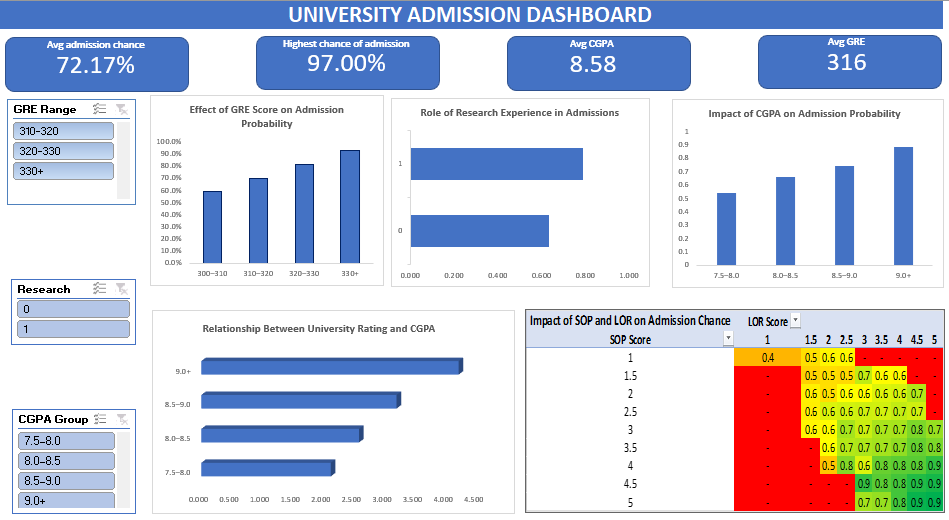
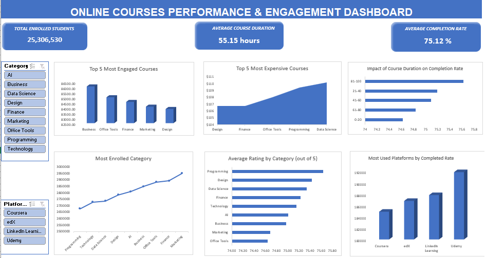
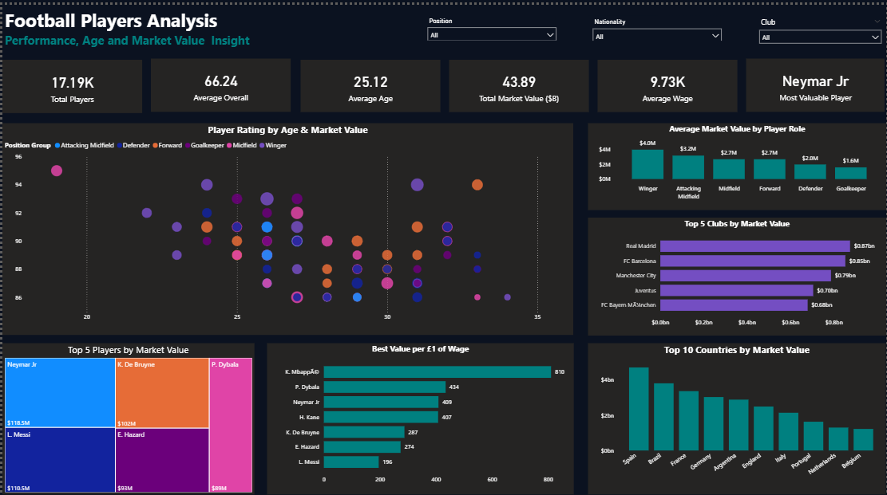

# Data analytic portfolio 
# Project 1
## 🎓[University Admission Dashboard](https://github.com/justice3613/Justice3613.github.io/blob/main/admission_data_set.xlsx)

## Tools Used
- Microsoft Excel (Pivot Tables, Power Query)
- Data Cleaning & Transformation
- Data Visualization
  
---

## Project Description
This project explores how GRE scores, CGPA, research experience, and supporting documents (SOP & LOR) influence admission chances all through an interactive Excel dashboard designed for quick, real insights.

This project analyzes the key factors influencing university admission probability using an interactive Excel dashboard. It focuses on understanding how academic performance and supporting elements combine to impact outcomes.

---

## 📊 Dashboard Features

### Effect of GRE Score on Admission Probability
A column chart showing how GRE score ranges influence admission probability. The visual helps reveal how stronger GRE scores are associated with better admission chances.

### Role of Research Experience in Admissions
A horizontal bar chart comparing admission probability between applicants with and without research experience, helping assess the impact of research exposure on admission outcomes

### Impact of CGPA on Admission Probability
A column chart illustrating how CGPA ranges affect admission chances, making it easier to understand the relationship between academic performance and admission success.

### Relationship Between University Rating and CGPA
A horizontal bar chart exploring the connection between university rating and student CGPA, helping identify how academic performance aligns with institutional quality.

### Impact of SOP and LOR on Admission Chance
A heatmap/matrix visualization showing how Statement of Purpose (SOP) scores and Letter of Recommendation (LOR) scores influence admission probability. This helps evaluate how qualitative application components contribute to admission success.

### Interactive Filters
Users can filter the dashboard by:

- **GRE Range**
- **Research Experience**
- **CGPA Group**

These filters allow users to dynamically explore admission trends and compare applicant performance across different academic and profile categories.

---

## 📈 Key findings
- Higher GRE Scores Significantly Improve Admission Chances:
Students with GRE scores of 330+ showed the highest probability of admission, while lower GRE ranges had noticeably reduced chances. This indicates that GRE performance remains a major factor in university admissions.

- Strong Academic Performance Increases Acceptance Probability:
Applicants with a CGPA above 9.0 had the strongest admission outcomes, highlighting the importance of consistent academic excellence in the selection process.

- Research Experience Provides a Competitive Advantage:
Students with prior research experience demonstrated higher admission probabilities compared to those without research exposure, showing that universities value practical and academic research involvement.

- University Ratings Closely Align with Student CGPA:
Higher rated universities were associated with applicants having stronger CGPAs, suggesting that top institutions tend to attract academically high-performing students.

- Impact of SOP and LOR on Admission Chances:
The heat map shows that applicants with strong SOP and LOR scores, especially in the 4.0–5.0 range, have the highest chances of admission, highlighting the importance of a well-rounded and compelling application profile.

- Balanced Profiles Perform Better:
The dashboard indicates that students with a combination of strong GRE scores, high CGPA, and research experience are more likely to secure admission offers.

---

## What This Project Shows
Admissions are not based on a single factor. Strong academics form the foundation, while supporting elements like SOP and LOR help differentiate candidates with similar scores.

---

## 📷 Dashboard Preview
 

---

# Project 2

## 📚 [Online Courses Performance & Engagement Dashboard](https://github.com/justice3613/Justice3613.github.io/blob/main/online_course_uses.xlsx)
---

## Tools Used
- Microsoft Excel (Pivot Tables, Power Query)
- Data Cleaning & Transformation
- Data Visualization

---

## Project Description
This project analyzes online course data to understand patterns in student engagement, completion rates, and platform performance. The goal is to identify what drives course success across different categories and learning platforms.

The dashboard provides an interactive view of how factors like category, platform, pricing, and ratings influence enrollment and completion behavior.

---

## 📊 Dashboard Features

### Top 5 Most Engaged Courses
A column chart highlighting the top-performing course categories based on student engagement. This helps identify which course areas attract and retain the most learner participation.

### Top 5 Most Expensive Courses
An area chart comparing the highest-priced course categories, helping users understand pricing trends across different learning areas.

### Impact of Course Duration on Completion Rate
A horizontal bar chart showing the relationship between course duration and completion rate. This helps determine whether shorter or longer courses tend to achieve higher completion levels.

### Most Enrolled Category
A line chart visualizing student enrollment across different course categories, making it easier to identify the most popular learning areas among students.

### Average Rating by Category (Out of 5)
A horizontal bar chart comparing average learner ratings across course categories, helping assess learner satisfaction and course quality.

## Most Used Platforms by Completion Rate
A column chart showing how different learning platforms perform based on course completion rates, helping identify platforms with stronger learner engagement.

### Interactive Filters
Users can filter the dashboard by:

- **Category:** Analyze performance across different course categories  
- **Platform:** Compare performance across learning platforms

These filters allow users to dynamically explore course performance, engagement, enrollment, ratings, and completion trends across different categories and learning platforms.

---

## 📈 Key Insights
- Learner Engagement Patterns: Identified Business courses as the most engaging category, indicating that learners are highly interested in career-oriented and practical professional skills.

- Enrollment Trends: Marketing courses recorded the highest enrollments, showing strong learner demand and broad audience appeal, while Programming and Technology attracted comparatively fewer enrollments.

- Premium Course Categories: Data Science and Programming emerged as the most expensive course categories, reflecting their high market demand and perceived career value.

- Course Duration Impact: Long duration courses (81–100 hours) achieved the highest completion rates, suggesting that committed learners are more likely to complete in-depth and structured learning programs.

- Category Satisfaction Levels: Data Science received the highest learner ratings, indicating strong course quality and learner satisfaction, whereas AI and Technology categories showed lower ratings and may require content improvement.

- Platform Performance Comparison: edX demonstrated the highest average completion rates among all platforms, highlighting the effectiveness of structured and academic style learning environments.

- Enrollment vs Engagement Gap: Although Marketing courses attracted the largest number of learners, they did not achieve the highest engagement levels, revealing opportunities to improve learner retention and interaction.

 - Strategic Growth Opportunities: The dashboard highlights opportunities to enhance low performing categories through updated content, interactive learning experiences, and platform specific course strategies.
This dashboard serves as a valuable analytical tool for online learning platforms and education providers, enabling data driven decisions related to course development, learner engagement, pricing strategies, and platform optimization.

---

## 📷 Dashboard Preview

  
---

# Project 3 
##  ⚽[Football Players Analysis Dashboard](https://github.com/justice3613/Justice3613.github.io/blob/main/fifa2.pbix)

---

## 🛠️ Tools Used

- **Power BI** – Data visualization and dashboard creation  
- **Microsoft Excel** – Data cleaning and preprocessing  
- **DAX (Data Analysis Expressions)** – Calculated columns and measures

---

## 📌 Project Description

This project focused on analysing football player data to better understand how factors such as age, performance, market value, wages, clubs, positions, and nationality influence player valuation and overall performance. The aim was to transform raw player data into meaningful insights that could support football scouting, recruitment decisions, and talent evaluation.

The dashboard was designed to give a clear and interactive overview of key player performance and financial metrics, helping users quickly identify patterns, compare players, and explore how value is distributed across clubs, countries, and playing positions.

The dashboard includes the following features:

---

## 📊 Dashboard Features

### Player Rating by Age & Market Value
A scatter plot showing the relationship between player age, overall rating, and market value. This helps identify peak performance periods and understand how player value changes across age groups.

### Average Market Value by Player Role
A comparison of average market values across different player positions, showing which roles command higher value in modern football.

### Top 5 Clubs by Market Value
Highlights clubs with the highest combined squad market value, revealing teams investing heavily in elite players.

### Top 5 Players by Market Value
Displays the most valuable players in the dataset, making it easier to identify football's top assets.

### Best Value per £1 of Wage
Shows players providing the highest market value relative to wages, helping identify financially efficient talent.

### Top 10 Countries by Market Value
Visualizes countries producing the highest-valued football players.

### Interactive Filters
Users can filter the dashboard by:

- **Position**
- **Nationality**
- **Club**

This makes it easier to drill down into specific segments and compare players dynamically.

---

## 🔍 Key Insights

### Peak Performance Age
Most highly rated football players fall between **24 and 31 years old**, suggesting this age range represents peak performance.

### Most Valuable Player Roles
**Wingers and attacking midfielders** recorded the highest average market values, reflecting the importance of attacking creativity in modern football.

### Top Clubs Dominate Market Value
Clubs such as **Real Madrid, FC Barcelona, Manchester City, Juventus, and Bayern Munich** consistently ranked among the highest in squad market value.

### Best Value for Money Players
Certain players delivered significantly higher market value relative to wages, highlighting strong financial efficiency.

### Talent Concentration by Country
Countries including **Spain, Brazil, France, Germany, and Argentina** emerged as major contributors of high-value football talent.

---

## 📈 Dashboard Overview

The dashboard provides a comprehensive view of football player performance and financial value. It combines player ratings, age, wages, market value, club strength, and nationality into one interactive experience.

By using dynamic filters and visual analysis, users can explore football talent from multiple perspectives and uncover patterns that support smarter recruitment and player valuation decisions.

---

## 📷 Dashboard Preview
 

---

# Project 4

**Title:** SQL Data Definition Language Sales Data

**SQL Code:** [Sales Data](https://github.com/justice3613/Justice3613.github.io/blob/main/Sales%20Data)

**SQL Skills Used:** 
- Creating databases and tables using CREATE DATABASE and CREATE TABLE  
- Inserting records with INSERT INTO  
- Modifying table structure using ALTER TABLE (add, drop, and modify columns)  
- Updating records using UPDATE  
- Deleting records with DELETE  
- Removing and resetting tables using TRUNCATE and DROP  
- Querying data using SELECT  
- Filtering data with WHERE, IN, NOT IN, and comparison operators  
- Working with date functions like DATEDIFF()  
- Handling real-world datasets (e.g., workplace safety data)
- Data Source Specification (FROM): Workplace Safety Data table

**Project Description:** This project demonstrates hands-on experience in managing and manipulating data using SQL. I designed and developed a sample database (ExpressSales) to store sales manager records, including key attributes such as personal details and location.

The work involved inserting and updating data, modifying table structures to meet changing requirements, and performing data cleaning based on specific conditions. I also applied SQL queries to analyze a workplace safety dataset, filtering and extracting insights based on factors like location and incident type.

Overall, this project highlights practical SQL skills in database design, data transformation, and querying to support real-world data analysis tasks.

**Technology used:** SQL server

---

# Project 4

**Title:** Employee Management System SQL Queries

**SQL Code:** [Employee Management System](https://github.com/justice3613/Justice3613.github.io/blob/main/Employee%20Management%20System)

**SQL Skills Used:** 
- Writing SELECT queries to pull specific data
- Filtering results using WHERE, BETWEEN, AND, and OR 
- Using aggregate functions like COUNT(), MAX(), MIN(), and AVG()
- Removing duplicates with DISTINCT
- Pattern matching with LIKE and wildcards (%, _)
- Combining results from multiple tables using UNION
- Creating calculated columns (e.g., total salary)
- Calculated fields and expressions for derived data.
- Data Source Specification (FROM): Employee_Details and Employee_Salary table

**Project Description:** This project is a set of structured SQL queries that work with an employee database. The goal was to answer real business questions, like finding employees who work for certain managers, looking at salary distributions, filtering employees by location and project assignments, and searching for patterns in employee names.

There are tables in the dataset like EmployeeDetails and EmployeeSalary that let you look into how employee information, project assignments, and pay are all connected. Each query shows a basic SQL idea while also showing how it would be used in real life, like in data analysis and backend systems.

**Technology used:** SQL server

---
# Project 5

**Title:**  SQL MultiTable Queries and Reports

**SQL Code:** [SQL MultiTable Queries and Reports](https://github.com/justice3613/Justice3613.github.io/blob/main/SQL%20MultiTable%20Queries%20and%20Reports)

**SQL Skills Used:** 
- Writing multi table queries using JOIN (INNER, LEFT, RIGHT, CROSS)
- Working with relationships between tables (salesman, customer, orders)
- Filtering data using WHERE, BETWEEN, and conditional logic
- Sorting results using ORDER BY
- Generating reports with multiple fields from different tables
- Using aggregate-style thinking for business reporting scenarios
- Handling Cartesian products (CROSS JOIN)
- Applying business rules (e.g., commission thresholds, grade filters)
- Combining and structuring data for real-world use cases
- Writing optimized queries for relational datasets

**Project Description:**  This project is about writing complex SQL queries for a sales database that has tables for salespeople, customers, and orders.

The queries are made to help with real business problems, like figuring out how salespeople and customers are related, looking at order patterns, and making structured reports. The project includes a lot of different situations, such as filtering data by order amounts, figuring out commission percentages, and comparing where customers and salespeople are located.

It also looks at more advanced ideas like multi-table joins, conditional reporting, and Cartesian products to model complicated data relationships. There are a number of queries that can be used to make business-style reports, like keeping track of customer orders, finding customers who aren't buying anything, and looking at how well sales are doing.

**Technology used:**  SQL server
